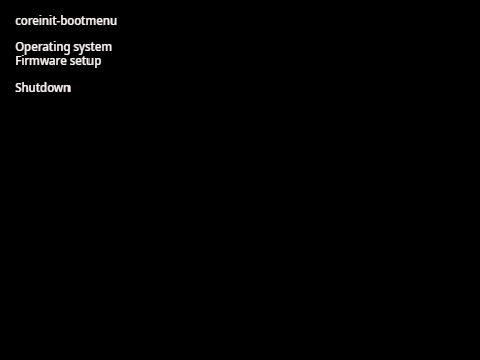
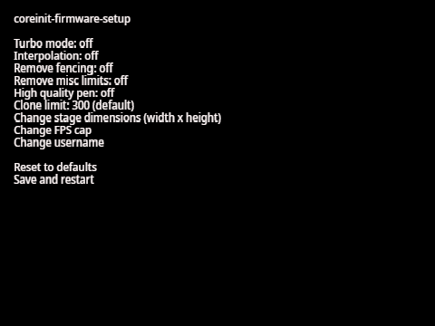

# coreinit

## About

  
  
  

 

coreinit is a modular, minimal bootloader designed to provide a clean, efficient, and extensible startup experience for your operating systems. Built in Turbowarp, it focuses on simplicity and flexibility, allowing developers and advanced users to tailor the boot process to their needs.

At its core, coreinit handles fundamental system initiation tasks, preparing the environment for the operating system to take over. It provides a boot splash, ensuring a visually consistent startup, and can optionally include advanced components such as the boot menu and firmware setup utilities. Because it is modular, these features can be added, removed, or replaced depending on the requirements of the system it is installed on.

This modularity also enables coreinit to integrate with auxiliary tools like coreinit-bootmenu, coreinit-firmware-setup, and coreinit-updater, forming a lightweight yet powerful boot management ecosystem. Whether used as a simple, no-frills bootloader or as part of an advanced multi-OS setup with deep runtime customization, coreinit provides a robust foundation for a wide range of use cases. 

> *Starting from release 1.3, coreinit will be Turbowarp-exclusive, and will not work in Scratch. For release 1.2 and below, coreinit-firmware-setup is Turbowarp-exclusive. All other sprites work in Scratch.*

## Extensions

coreinit-bootmenu is the utility responsible for managing the boot menu for coreinit. It provides an interface for selecting between multiple operating systems at startup and accessing advanced firmware-level utilities, such as coreinit-firmware-setup. This makes it an essential tool for users who need fine-grained control over their system environment and want to experiment with different configurations or setups. While coreinit-bootmenu enhances usability, it is not required for coreinit to function. coreinit can operate normally without the boot menu, and coreinit-bootmenu itself can run independently, although it will not initialize unless it receives the "coreinit-initialize" message from coreinit. This flexible design allows users to use coreinit utilities selectively, depending on their system configuration and needs.

coreinit-firmware-setup is the utility that allows you to modify the Scratch runtime at a low level. It is an extremely powerful tool, giving you control over many aspects of the environment that are normally fixed, including the clone limit, your username, framerate cap, stage resolution, and other hidden runtime parameters. By adjusting these settings, users can optimize performance, experiment and unlock features that are otherwise inaccessible in the standard Scratch interface. coreinit-firmware-setup requires coreinit-bootmenu to be installed for it to work.

coreinit-updater is the utility that allows you to update coreinit quickly and easily with just a click of a button. This tool simplifies the process of keeping your system up to date, ensuring you always have the latest features, bug fixes, and performance improvements. In addition to standard updates, coreinit-updater also provides a reinstall option, accessible from the entry at the bottom left of the coreinit-bootmenu, allowing you to completely refresh your installation whenever necessary. It is important to note that an active internet connection is required for updates or reinstallations. Additionally, performing an update or reinstall will reset all custom tweaks and settings, so it is recommended to use this utility primarily on advanced operating systems or setups where you are prepared to reapply any modifications afterward. coreinit-updater requires coreinit-bootmenu to be installed for it to work.

## Features

coreinit features:
- Extremely modular, with everything being optional
- Easily customizable with barely any branding
- Modifiable with easy-to-read code
- Faster and easier than coding your own boot splash

## Installation

Simply import the "coreinit" sprite into your project. Remember to make all your scripts start after the "coreboot_boot" message and end after the "coreboot_shutdown" message. For no layering problems, you should hide all sprites before "coreboot_boot" and after "coreboot_shutdown". Optionally, you can also import the "coreinit-bootmenu" and "coreinit-firmware-setup" sprites for a more complete experience.
